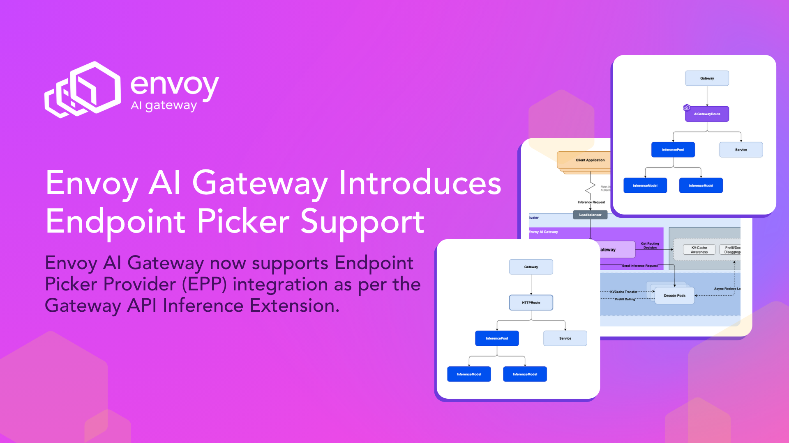
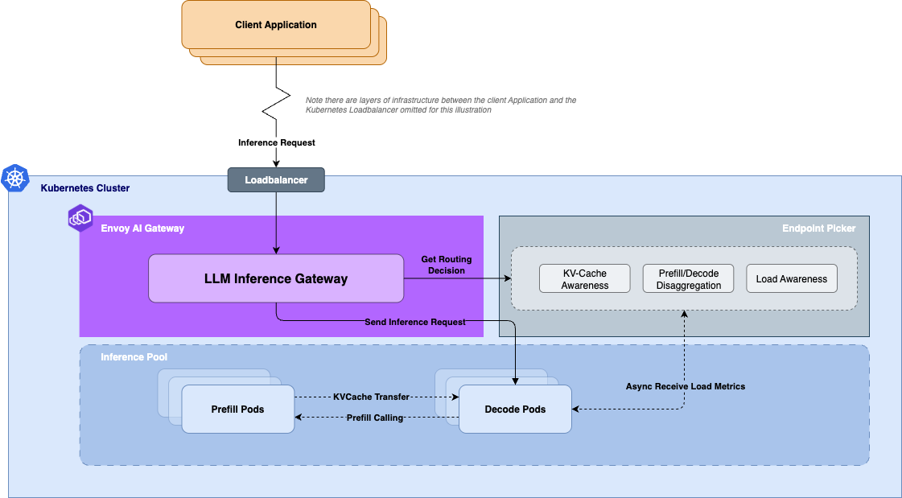
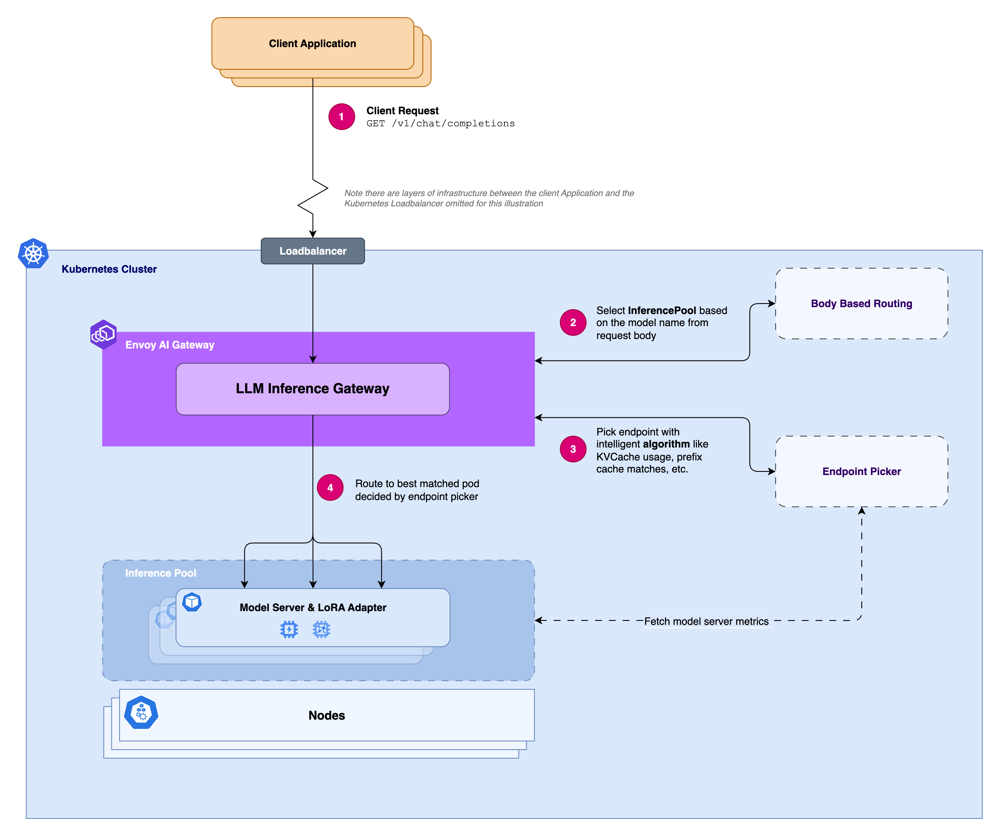
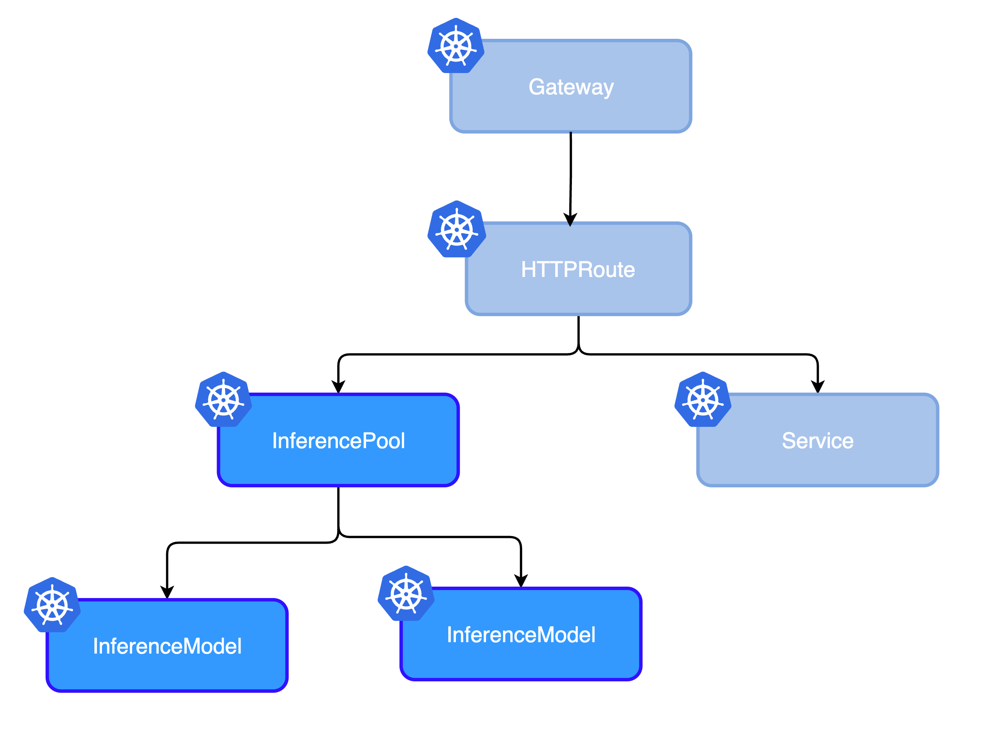

# Envoy AI Gateway Introduces Endpoint Picker Support: Enabling AI Inference Routing


## Introduction

**Envoy AI Gateway now supports Endpoint Picker Provider (EPP) integration as per the** [Gateway API Inference Extension](https://gateway-api-inference-extension.sigs.k8s.io/).

This feature enables you to leverage intelligent, dynamic routing for AI inference workloads through intelligent endpoint selection based on real-time metrics, including KV-cache usage, queued requests, and LoRA adapter information.

When running AI inference at scale, this means your system can automatically select the optimal inference endpoint for each request, thereby optimizing resource utilization.



<!-- truncate -->

## The Problem: Traditional Load Balancing Falls Short for AI Workloads

As LLM inference workloads have a new set of characteristics compared to traditional API servers, informing the load balancer of which upstream target is the most optimal to serve the request requires a new set of information for making those decisions.

Some of the unique characteristics of AI inference workloads:

- **Variable processing times** based on model complexity and input size
- **Different resource requirements** for different models and configurations
- **Real-time performance metrics** that change constantly (KV-cache usage, queue depth, etc.)
- **Specialized hardware requirements** (GPUs, TPUs, different model variants)

Without taking these into account when routing, you’ll end up with:

- Overloaded endpoints while others sit idle
- Increased latency due to poor endpoint selection
- Resource waste from suboptimal load distribution
- Manual intervention is required for optimal performance

## The Solution: Endpoint Picker Provider Integration

Envoy AI Gateway's new EPP support addresses these challenges by providing users with the option to integrate an Endpoint Picker. The endpoint picker will take these pieces of information into account and inform the gateway of the best upstream target to route the request to.



### 1\. Intelligent Endpoint Selection

The Endpoint Picker (EPP) automatically routes requests to the most suitable backend by analyzing real-time metrics from your inference endpoints, such as:

- Current KV-cache usage
- Number of queued inference requests
- LoRA adapter information
- Endpoint health and performance metrics

### 2\. Dynamic Load Balancing

Unlike static load balancers, the EPP continuously receives endpoint status, which affects routing decisions in real-time. This dynamic decision ensures optimal resource utilization across your entire inference infrastructure.

### 3\. Automatic Failover

When an endpoint becomes unavailable or performance degrades, the EPP automatically routes traffic to healthy alternatives, ensuring high availability for your AI services.

### 4\. Extensible Architecture

The EPP architecture supports custom endpoint picker providers, allowing you to implement domain-specific routing logic tailored to your unique requirements.

## How It Works: Two Integration Approaches

Envoy AI Gateway supports EPP integration through two powerful approaches:

### HTTPRoute \+ InferencePool

For simple inference workloads, you can use the standard Gateway API HTTPRoute with InferencePool. This approach offers basic intelligent routing, automatic load balancing, and straightforward configuration, making it ideal for simple use cases.



```yaml
apiVersion: gateway.networking.k8s.io/v1
kind: HTTPRoute
metadata:
  name: inference-pool-with-httproute
  namespace: default
spec:
  parentRefs:
    - group: gateway.networking.k8s.io
      kind: Gateway
      name: inference-pool-with-httproute
      namespace: default
  rules:
    - backendRefs:
        - group: inference.networking.k8s.io
          kind: InferencePool
          name: vllm-llama3-8b-instruct
          namespace: default
          weight: 1
      matches:
        - path:
            type: PathPrefix
            value: /
      timeouts:
        request: 60s
```

This approach provides:

- Basic intelligent routing
- Automatic load balancing
- Simple configuration

### AIGatewayRoute \+ InferencePool

For advanced AI-specific features, use Envoy AI Gateway's custom AIGatewayRoute.


```yaml
apiVersion: aigateway.envoyproxy.io/v1alpha1
kind: AIGatewayRoute
metadata:
  name: inference-pool-with-aigwroute
  namespace: default
spec:
  schema:
    name: OpenAI
  targetRefs:
    - name: inference-pool-with-aigwroute
      kind: Gateway
      group: gateway.networking.k8s.io
  rules:
    - matches:
        - headers:
            - type: Exact
              name: x-ai-eg-model
              value: meta-llama/Llama-3.1-8B-Instruct
      backendRefs:
        - group: inference.networking.k8s.io
          kind: InferencePool
          name: vllm-llama3-8b-instruct
    - matches:
        - headers:
            - type: Exact
              name: x-ai-eg-model
              value: mistral:latest
      backendRefs:
        - group: inference.networking.k8s.io
          kind: InferencePool
          name: mistral
    - matches:
        - headers:
            - type: Exact
              name: x-ai-eg-model
              value: some-cool-self-hosted-model
      backendRefs:
        - name: envoy-ai-gateway-basic-testupstream
```

This enhanced approach adds:

- **Multi-model routing** based on the request body modelName
- **Token-based rate limiting** for cost control in self-hosted Models
- **Advanced LLM observability** across LLM Models

## Real-World Benefits

### For AI/ML Engineers

- **Lower latency**: Requests automatically routed to optimal endpoints
- **Better throughput**: Intelligent distribution prevents bottlenecks
- **Cost optimization**: Efficient resource usage reduces infrastructure costs
- **Enhanced observability**: Real-time metrics and performance insights

### For Platform Teams

- **Standards compliance**: Built on the Gateway API Inference Extension
- **Vendor flexibility**: Support for multiple EPP implementations
- **Future-proof architecture**: Extensible design for evolving requirements
- **Kubernetes-native**: Seamless integration with existing infrastructure

### For DevOps Teams

- **Reduced operational overhead**: No more manual endpoint management
- **Improved reliability**: Automatic failover and health monitoring
- **Better resource utilization**: Dynamic load balancing maximizes efficiency
- **Simplified scaling**: Add new endpoints without configuration changes

## Getting Started

Setting up EPP support in Envoy AI Gateway is straightforward:

### 1\. Install InferencePool CRDs

```shell
# Install Gateway API Inference Extension
kubectl apply -f https://github.com/kubernetes-sigs/gateway-api-inference-extension/releases/download/v0.5.1/manifests.yaml
```

### 2\. Deploy Your Inference Backends

```shell
# Deploy sample vLLM backend
kubectl apply -f https://github.com/kubernetes-sigs/gateway-api-inference-extension/raw/v0.5.1/config/manifests/vllm/sim-deployment.yaml
```

### 3\. Configure InferenceObjective and InferencePool

```yaml
apiVersion: inference.networking.k8s.io/v1
kind: InferenceObjective
metadata:
  name: base-model
spec:
  modelName: meta-llama/Llama-3.1-8B-Instruct
  criticality: Critical
  poolRef:
    name: vllm-llama3-8b-instruct
---
apiVersion: inference.networking.k8s.io/v1
kind: InferencePool
metadata:
  name: vllm-llama3-8b-instruct
spec:
  targetPortNumber: 8000
  selector:
    app: vllm-llama3-8b-instruct
  extensionRef:
    name: vllm-llama3-8b-instruct-epp
```

### 4\. Create Your Route

Choose between HTTPRoute or AIGatewayRoute based on your needs, and you're ready to go\!

## What's Next

The introduction of EPP support represents a significant milestone in Envoy AI Gateway's evolution. This feature enables intelligent routing for AI workloads, making it easier than ever to deploy and manage production AI inference services.

### Upcoming Enhancements

- **Upstream Conformance Test**: Integrate with **Gateway API Inference Extension** Conformance Tests.
- **Fallback Support**: This feature provides support for endpoint picker fallback when the Endpoint Picker is unavailable, based on the Envoy HostOverride LbPolicy. It ensures continuous service availability even in the event of Endpoint Picker failure.
- **Internal Managed EPP**: This upcoming feature will provide support for an Envoy AI Gateway-managed Endpoint Picker, simplifying the management of your AI inference endpoints.
- **Enhance End-to-End (E2E) Testing**: Add more E2E tests for InferencePool support.

### Community Contributions

We're excited to see how the community leverages this capability. Whether you're building custom EPP implementations, contributing to the Gateway API Inference Extension, or sharing your deployment experiences, we'd love to hear from you.

## Conclusion

Endpoint Picker Provider support enables Envoy AI Gateway to serve not only as an Egress AI Gateway but also as an Ingress AI Gateway for AI inference workloads. By automatically selecting optimal endpoints based on real-time metrics, this feature improves performance and maximizes resource utilization for hosted inference systems.

Whether you're running a small AI service or a large-scale inference platform, EPP support provides the intelligent routing capabilities you need to deliver reliable, high-performance AI services to your users.

Ready to get started with Envoy AI Gateway? Check out our [documentation](https://aigateway.envoyproxy.io/docs/capabilities/inference/) for guides and examples, join our [community discussions](https://github.com/envoyproxy/ai-gateway/discussions) to share your experiences, raise issues, request features, and learn from others.

---

*Envoy AI Gateway continues to evolve as the premier solution for routing and managing AI workloads. Stay tuned for more exciting features and capabilities as we work to simplify, enhance, and improve the reliability and efficiency of AI deployment.*

## Resources

- [Inference Optimization Documentation](/docs/capabilities/inference/)
- [Gateway API Inference Extension](https://gateway-api-inference-extension.sigs.k8s.io/)
- [AIGatewayRoute \+ InferencePool Guide](/docs/capabilities/inference/aigatewayroute-inferencepool/)
- [HTTPRoute \+ InferencePool Guide](/docs/capabilities/inference/httproute-inferencepool/)
- [GitHub Repository](https://github.com/envoyproxy/ai-gateway)
